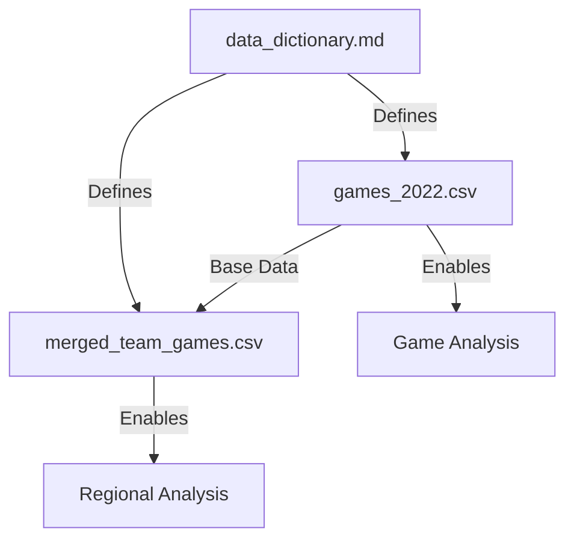

# Basketball Dataset Documentation

## Dataset Overview
This collection of files provides comprehensive basketball game statistics and metrics for analyzing team performance and creating advanced analytics like RAPTOR ratings.

## File Structure

### 1. games_2022.csv
**Purpose**: Raw game-by-game statistics for the 2022 season
- Contains basic game statistics
- Each row represents one team's performance in a single game
- Includes both teams' statistics in separate rows for each game
- Primary source for game-level analysis

### 2. merged_team_games.csv
**Purpose**: Enhanced version of games data with additional regional information
- Builds upon games_2022.csv
- Adds regional classification for teams
- Enables regional performance analysis
- Facilitates geographic trend analysis

### 3. data_dictionary.md
**Purpose**: Reference documentation for understanding data fields
- Defines all columns and metrics
- Provides context for statistical calculations
- Explains measurement units and formats
- Essential for accurate data interpretation

## Relationships Between Files



## Key Relationships

1. **Game Identification**
   - Both data files use `game_id` as primary key
   - Format: game_YEAR_NUMBER
   - Enables cross-referencing between files

2. **Team Information**
   ```
   games_2022.csv        merged_team_games.csv
   └── team      ─────── └── team
                         └── region (additional)
   ```

3. **Statistical Continuity**
   - Core statistics remain consistent across files
   - Same measurement units and formats
   - Enables reliable comparative analysis

## Use Cases

1. **Basic Game Analysis**
   - Use games_2022.csv for:
     * Individual game statistics
     * Team performance metrics
     * Head-to-head comparisons

2. **Regional Analysis**
   - Use merged_team_games.csv for:
     * Regional performance trends
     * Geographic impact on performance
     * Regional competitive analysis

3. **Advanced Analytics**
   - Combine both files for:
     * RAPTOR rating calculations
     * Complex performance metrics
     * Multi-dimensional analysis

## Data Flow

1. **Collection Phase**
   ```
   Game Events → Basic Statistics → games_2022.csv
   ```

2. **Enhancement Phase**
   ```
   games_2022.csv → Regional Addition → merged_team_games.csv
   ```

3. **Analysis Phase**
   ```
   Both Files → Advanced Metrics → RAPTOR Ratings
   ```

## Best Practices for Usage

1. **Data Loading**
   - Start with games_2022.csv for basic analysis
   - Use merged_team_games.csv when regional context is needed
   - Always reference data_dictionary.md for field definitions

2. **Analysis Flow**
   - Begin with game-level statistics
   - Progress to regional patterns
   - Conclude with advanced metrics

3. **Quality Considerations**
   - Check for complete game records
   - Verify regional classifications
   - Validate statistical calculations

## Applications

1. **Performance Analysis**
   - Team efficiency metrics
   - Player contribution analysis
   - Win-loss predictions

2. **Regional Insights**
   - Geographic performance patterns
   - Travel impact analysis
   - Regional competitive advantages

3. **Advanced Metrics**
   - RAPTOR rating development
   - Custom performance indices
   - Predictive modeling

## Notes and Considerations

1. **Data Integrity**
   - Both files maintain consistent statistical foundations
   - Regional additions don't affect core metrics
   - Cross-validation possible between files

2. **Analysis Tips**
   - Use appropriate file based on analysis needs
   - Consider regional context when relevant
   - Leverage relationship between files for comprehensive insights

3. **Future Extensions**
   - Additional regional metrics possible
   - Temporal analysis opportunities
   - Advanced statistical modeling potential